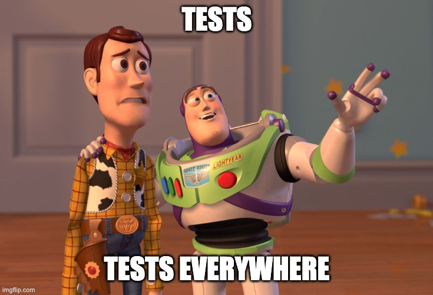
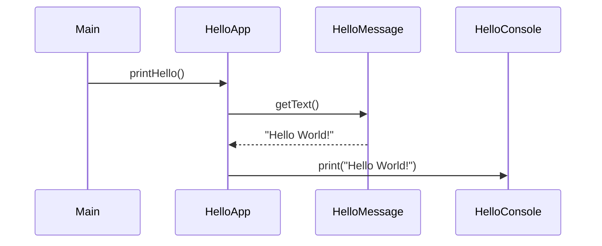
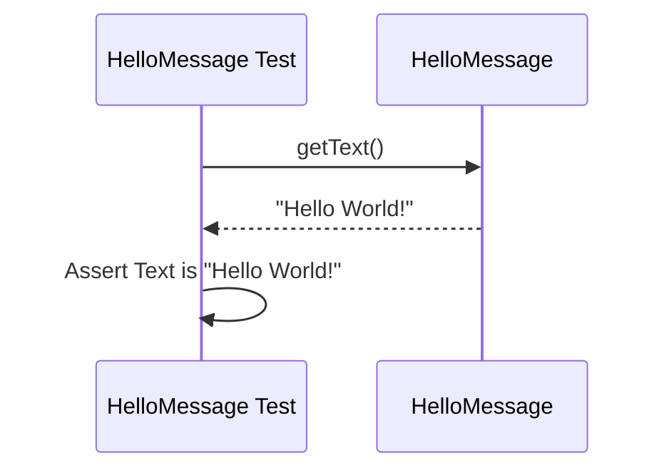
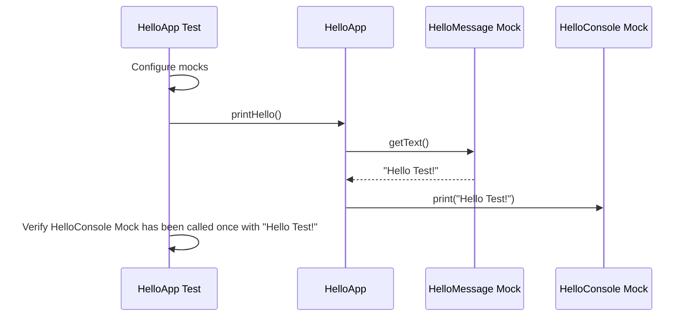

# Tests, Tests Everywhere!









1) [Java](#java)
2) [Kotlin](#kotlin)
3) [JavaScript](#javascript)
4) [Ruby](#ruby)
4) [Go](#go)


## Java

[](https://github.com/rogervinas/tests-everywhere/actions/workflows/java.yml)


[Java](https://openjdk.org/) testing with [JUnit5](https://junit.org/junit5/), [Mockito](https://site.mockito.org/) and [AssertJ](https://assertj.github.io/doc/)

### Run this project using 🐳 [docker](https://www.docker.com/)
* Go to [java](java) folder
* Execute `./docker-run.sh`
* Once inside the container:
  * Test with `./gradlew test`
  * Run with `./gradlew run`

### Run this project locally

#### Pre-requisites
* Install [Java](https://openjdk.org/) and [Gradle](https://gradle.org/) manually or ...
  * Install [SdkMan](https://sdkman.io/) and ...
    * List available versions executing `sdk list java` and `sdk list gradle`
    * Install **Java** executing `sdk install java 21-tem`
    * Install **Gradle** executing `sdk install grade 8.4`

#### Run locally
* Go to [java](java) folder
* Test with `./gradlew test`
* Run with `./gradlew run`

#### Create project from scratch
* Create project using `gradle init --type java-application --dsl kotlin --test-framework junit-jupiter`
* Add [Mockito](https://site.mockito.org/) and [AssertJ](https://assertj.github.io/doc/) dependencies in [build.gradle.kts](java/build.gradle.kts):
  * `testImplementation("org.mockito:mockito-core:x.x.x")`
  * `testImplementation("org.assertj:assertj-core:x.x.x")`

## Kotlin

[](https://github.com/rogervinas/tests-everywhere/actions/workflows/kotlin.yml)


[Kotlin](https://kotlinlang.org/) testing with [Kotest](https://kotest.io) and [MockK](https://mockk.io/)

### Run this project using 🐳 [docker](https://www.docker.com/)
* Go to [kotlin](kotlin) folder
* Execute `./docker-run.sh`
* Once inside the container:
  * Test with `./gradlew test`
  * Run with `./gradlew run`

### Run this project locally

#### Pre-requisites
* Install [Java](https://openjdk.org/) and [Gradle](https://gradle.org/) manually or ...
  * Install [SdkMan](https://sdkman.io/) and ...
    * List available versions executing `sdk list java` and `sdk list gradle` 
    * Install **Java** executing `sdk install java 21-tem`
    * Install **Gradle** executing `sdk install grade 8.4`

#### Run locally
* Go to [kotlin](kotlin) folder
* Test with `./gradlew test`
* Run with `./gradlew run`

#### Create project from scratch
* Create project using `gradle init --type kotlin-application --dsl kotlin --test-framework kotlintest`
* Add [Kotest](https://kotest.io) and [MockK](https://mockk.io/) dependencies in [build.gradle.kts](kotlin/build.gradle.kts):
  * `testImplementation("io.kotest:kotest-runner-junit5:x.x.x")`
  * `testImplementation("io.mockk:mockk:x.x.x")`

## JavaScript

[](https://github.com/rogervinas/tests-everywhere/actions/workflows/javascript.yml)


[JavaScript](https://developer.mozilla.org/docs/Web/JavaScript) testing with [Jest](https://jestjs.io/)

### Run this project using 🐳 [docker](https://www.docker.com/)
* Go to [javascript](javascript) folder
* Execute `./docker-run.sh`
* Once inside the container:
  * First time only, install dependencies with `npm install` 
  * Test with `npm test`
  * Run with `npm start`

### Run this project locally

#### Pre-requisites
* Install [Node.js](https://nodejs.org/en/) manually or ...
  * Install [Node Version Manager](https://github.com/nvm-sh/nvm) and ...
    * List available versions executing `nvm list`
    * Install **Node.js** executing `nvm use v18` or `nvm use stable`

#### Run locally
* Go to [javascript](javascript) folder
* First time only, install dependencies with `npm install`
* Test with `npm test`
* Run with `npm start`

#### Create project from scratch
* Create project using `npm init`
* Install [Jest](https://jestjs.io/) using `npm install --save-dev jest`
* Configure scripts in [package.json](javascript/package.json):
  ```json
  "scripts": {
    "start": "node Main.js",
    "test": "jest"
  }
  ```

## Ruby

[](https://github.com/rogervinas/tests-everywhere/actions/workflows/ruby.yml)


[Ruby](https://www.ruby-lang.org) testing with [RSpec](https://rspec.info/)

### Run this project using 🐳 [docker](https://www.docker.com/)
* Go to [ruby](ruby) folder
* Execute `./docker-run.sh`
* Once inside the container:
  * First time only, install dependencies with `bundle install`
  * Test with `rspec -fd`
  * Run with `ruby lib/Main.rb`

### Run this project locally

#### Pre-requisites
* Install [Ruby](https://www.ruby-lang.org/en/documentation/installation/) manually or ...
  * Install [renv](https://github.com/rbenv/rbenv#readme) version manager and ..
    * List available versions executing `rbenv install -l`
    * Install **Ruby** executing `rbenv install 3.2.2` and `rbenv global 3.2.2`

#### Run locally
* Go to [ruby](ruby) folder
* First time only, install dependencies with `bundle install`
* Test with `rspec -fd`
* Run with `ruby lib/Main.rb`

#### Create project from scratch
* Just create a [Gemfile](ruby/Gemfile)
* Execute `bundle install`

## Go

[](https://github.com/rogervinas/tests-everywhere/actions/workflows/go.yml)


[Go](https://go.dev/) testing

### Run this project using 🐳 [docker](https://www.docker.com/)
* Go to [go](go) folder
* Execute `./docker-run.sh`
* Once inside the container:
  * Test with `go test -test.v`
  * Run with `go run .`

### Run this project locally

#### Pre-requisites
* Install [Go](https://go.dev/dl/)

#### Run locally
* Go to [go](go) folder
* Test with `go test -test.v`
* Run with `go run .`

#### Create project from scratch
* Execute `go mod init org.hello/main`
