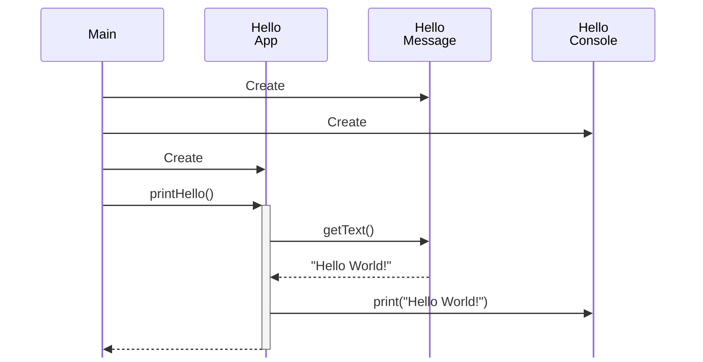
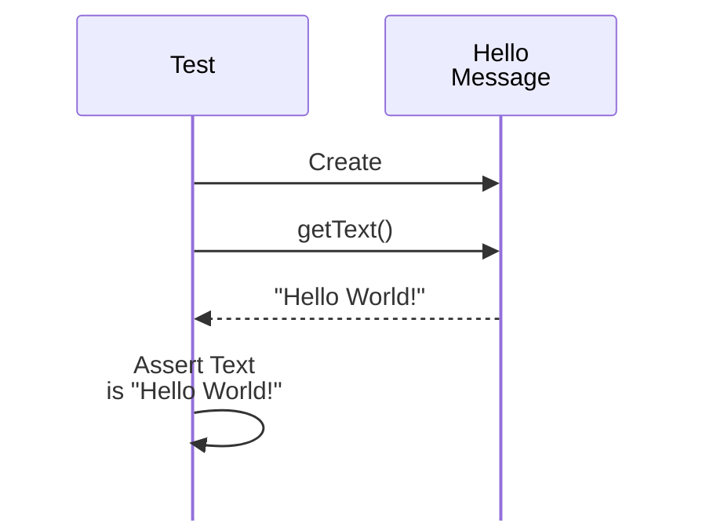
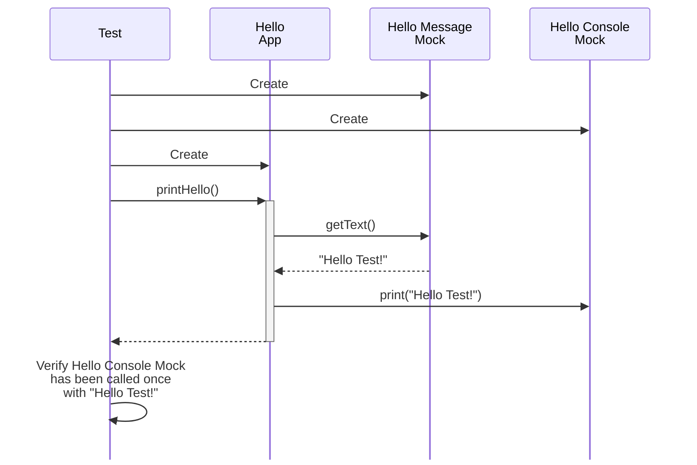

# Tests, Tests Everywhere!

Welcome to the **Hello World!** of **testing** using the most popular programming languages ...

|  |  |  |  |  |
|:--------------------------------------:|:----------------------------------------:|:--------------------------------------------:|:--------------------------------------:|--------------------------------------|
|              [Java](java)              |             [Kotlin](kotlin)             |           [JavaScript](javascript)           |              [Ruby](ruby)              | [Go](go)                             |

In each of them we will implement this simple logic:

And we will test both **HelloMessage** ...

... and **HelloApp**:

Happy Coding! 💙
